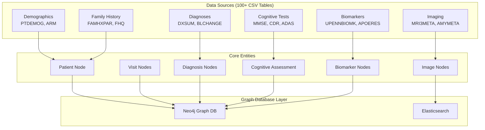

# ADNI Knowledge Graph: Architecture, Data Model & Query Guide

## 🏗️ Architecture Overview

The ADNI Knowledge Graph transforms heterogeneous clinical trial data into a sophisticated graph database that models the complex relationships in Alzheimer's disease research. The architecture follows a multi-layered approach:


 
## 📊 Data Model & Table Relationships

### Core Tables and Their Purpose

#### 1. Patient Demographics Tables

| Table | Purpose | Key Fields | Connections |
|-------|---------|------------|------------|
| PTDEMOG | Primary demographics | PTID, PTGENDER, PTEDUCAT, PTMARRY | Central patient node |
| ARM | Study arm assignment | PTID, ARM (CN/MCI/AD) | Initial diagnosis classification |
| PTRACCAT | Race/ethnicity data | PTID, PTETHCAT, PTRACCAT | Demographics enrichment |

Why Connected: These tables form the foundation of each patient's profile. PTDEMOG provides core demographics while ARM determines their initial study group (Cognitively Normal, MCI, or AD).

#### 2. Cognitive Assessment Tables

| Table | Purpose | Score Range | Clinical Significance |
|-------|---------|-------------|----------------------|
| MMSE | Mini-Mental State Exam | 0-30 | <24 indicates impairment |
| CDR | Clinical Dementia Rating | 0-3 | 0=normal, 0.5=MCI, ≥1=dementia |
| ADAS | AD Assessment Scale | 0-70 | Higher = worse cognition |
| MOCA | Montreal Cognitive Assessment | 0-30 | <26 indicates impairment |
| FAQ | Functional Activities | 0-30 | >9 indicates functional impairment |

Connection Logic:
```cypher
// Each cognitive test connects to visits and patients
(Patient)-[:HAS_VISIT]->(Visit)-[:HAS_COGNITIVE_ASSESSMENT]->(CognitiveAssessment)
```

#### 3. Biomarker Tables

| Table | Purpose | Biomarkers | Thresholds |
|-------|---------|------------|------------|
| UPENNBIOMK_ROCHE_ELECSYS | CSF biomarkers | Aβ42, Tau, p-Tau | Aβ42<192 pg/mL = abnormal |
| APOERES | Genetic risk | APOE genotype | ε4 allele = increased risk |
| JANSSEN_PLASMA_P217_TAU | Blood biomarkers | Plasma p-tau217 | Novel AD marker |

Why These Connections Matter: Biomarkers provide biological evidence of AD pathology. CSF Aβ42 indicates amyloid plaques, while tau markers show neurodegeneration.

#### 4. Diagnosis Tables

| Table | Key Fields | Diagnosis Codes |
|-------|------------|-----------------|
| DXSUM | DIAGNOSIS, DXNORM, DXMCI, DXAD | 1=CN, 2=MCI, 3=AD |
| BLCHANGE | BCPREDX | Baseline prediction |

## 🔍 Key Query Patterns

### 1. Patient Trajectory Analysis

```cypher
// Find patients who progressed from CN to MCI to AD
MATCH path = (p:Patient)-[:HAS_DIAGNOSIS]->(d1:Diagnosis {diagnosis_code: 'CN'})
MATCH (p)-[:HAS_DIAGNOSIS]->(d2:Diagnosis {diagnosis_code: 'MCI'})
MATCH (p)-[:HAS_DIAGNOSIS]->(d3:Diagnosis {diagnosis_code: 'AD'})
WHERE d1.visit_id < d2.visit_id < d3.visit_id
RETURN p.ptid as patient_id,
       d1.visit_id as cn_visit,
       d2.visit_id as mci_visit,
       d3.visit_id as ad_visit,
       duration.between(d1.visit_date, d3.visit_date).months as progression_months
```

### 2. ATN Framework Classification

The ATN (Amyloid-Tau-Neurodegeneration) framework is crucial for AD research:

```cypher
// Classify patients by ATN profile based on biomarkers
MATCH (p:Patient)-[:HAS_BIOMARKER]->(b:Biomarker)
WHERE b.biomarker_type = 'CSF'
WITH p,
     MAX(CASE WHEN b.analyte = 'ABETA42' AND b.value < 192 THEN 1 ELSE 0 END) as A_positive,
     MAX(CASE WHEN b.analyte = 'PTAU' AND b.value > 23 THEN 1 ELSE 0 END) as T_positive,
     MAX(CASE WHEN b.analyte = 'TAU' AND b.value > 93 THEN 1 ELSE 0 END) as N_positive
WITH p,
     CASE WHEN A_positive = 1 THEN 'A+' ELSE 'A-' END as A,
     CASE WHEN T_positive = 1 THEN 'T+' ELSE 'T-' END as T,
     CASE WHEN N_positive = 1 THEN 'N+' ELSE 'N-' END as N
MERGE (atn:ATNProfile {
    patient_id: p.ptid,
    profile: A + '/' + T + '/' + N
})
MERGE (p)-[:HAS_ATN_PROFILE]->(atn)
RETURN atn.profile, count(p) as patient_count
ORDER BY patient_count DESC
```

### 3. Genetic Risk Analysis with Family History

```cypher
// Find high-risk patients: APOE ε4 carriers with family history
MATCH (p:Patient)-[:HAS_GENETIC_MARKER]->(gm:GeneticMarker)
WHERE gm.genotype CONTAINS '4'
MATCH (p)-[:HAS_FAMILY_MEMBER]->(fm:FamilyMember)
WHERE fm.has_dementia = true
WITH p, 
     CASE 
       WHEN gm.genotype CONTAINS '4/4' THEN 'Homozygous ε4'
       WHEN gm.genotype CONTAINS '4' THEN 'Heterozygous ε4'
     END as apoe_status,
     count(fm) as affected_relatives
RETURN p.ptid as patient_id,
       p.age_at_baseline as age,
       apoe_status,
       affected_relatives,
       CASE 
         WHEN apoe_status = 'Homozygous ε4' AND affected_relatives > 0 THEN 'Very High'
         WHEN apoe_status = 'Heterozygous ε4' AND affected_relatives > 0 THEN 'High'
         ELSE 'Moderate'
       END as risk_category
ORDER BY risk_category
```

### 4. Cognitive Decline Rate Analysis

```cypher
// Calculate cognitive decline rates using MMSE scores
MATCH (p:Patient)-[:HAS_VISIT]->(v:Visit)-[:HAS_COGNITIVE_ASSESSMENT]->(ca:CognitiveAssessment)
WHERE ca.test_name = 'MMSE'
WITH p, v.months_from_baseline as months, ca.total_score as score
ORDER BY p.ptid, months
WITH p, collect({months: months, score: score}) as trajectory
WHERE size(trajectory) >= 3
WITH p, 
     trajectory[0].score as baseline_score,
     trajectory[-1].score as final_score,
     trajectory[-1].months - trajectory[0].months as duration_months
WHERE duration_months > 0
RETURN p.ptid as patient_id,
       baseline_score,
       final_score,
       duration_months,
       round((baseline_score - final_score) * 12.0 / duration_months, 2) as annual_decline_rate,
       CASE 
         WHEN (baseline_score - final_score) * 12.0 / duration_months > 3 THEN 'Fast Decliner'
         WHEN (baseline_score - final_score) * 12.0 / duration_months > 1 THEN 'Normal Decliner'
         ELSE 'Slow Decliner'
       END as decline_category
ORDER BY annual_decline_rate DESC
```

### 5. Multimodal Data Integration

```cypher
// Find patients with complete multimodal assessments at baseline
MATCH (p:Patient)-[:HAS_VISIT]->(v:Visit {viscode: 'bl'})
OPTIONAL MATCH (v)-[:HAS_COGNITIVE_ASSESSMENT]->(ca:CognitiveAssessment)
OPTIONAL MATCH (v)-[:HAS_BIOMARKER]->(b:Biomarker)
OPTIONAL MATCH (v)-[:HAS_DIAGNOSIS]->(d:Diagnosis)
OPTIONAL MATCH (v)-[:HAS_IMAGE]->(i:ImageNode)
WITH p, v,
     count(DISTINCT ca) as cognitive_tests,
     count(DISTINCT b) as biomarkers,
     count(DISTINCT d) as diagnoses,
     count(DISTINCT i) as images
WHERE cognitive_tests > 0 AND biomarkers > 0 AND images > 0
RETURN p.ptid as patient_id,
       cognitive_tests,
       biomarkers,
       diagnoses,
       images,
       cognitive_tests + biomarkers + diagnoses + images as data_completeness_score
ORDER BY data_completeness_score DESC
```

## 🔗 Why These Connections Matter

### Temporal Relationships

```cypher
// Visits are connected temporally to track progression
(Visit1)-[:FOLLOWED_BY {months_delta: 6}]->(Visit2)
```

Purpose: Enables longitudinal analysis of disease progression

### Disease Progression

```cypher
// Diagnoses connected to show progression
(Diagnosis:CN)-[:PROGRESSED_TO]->(Diagnosis:MCI)-[:PROGRESSED_TO]->(Diagnosis:AD)
```

Purpose: Models the typical AD progression pathway

### Biomarker-Diagnosis Associations

```cypher
// Biomarkers support diagnoses
(Biomarker {abnormal: true})-[:SUPPORTS_DIAGNOSIS]->(Diagnosis)
```

Purpose: Links biological evidence to clinical diagnoses

## 📈 Advanced Analytical Queries

### 1. Identify Rapid Progressors

```cypher
// Find patients who progressed from CN to AD in less than 3 years
MATCH (p:Patient)-[:HAS_DIAGNOSIS]->(d1:Diagnosis {diagnosis_code: 'CN'})
MATCH (p)-[:HAS_DIAGNOSIS]->(d2:Diagnosis {diagnosis_code: 'AD'})
WHERE d2.months_from_baseline - d1.months_from_baseline < 36
WITH p, d1, d2, d2.months_from_baseline - d1.months_from_baseline as progression_time
MATCH (p)-[:HAS_BIOMARKER]->(b:Biomarker)
WHERE b.viscode = 'bl'
RETURN p.ptid as patient_id,
       progression_time as months_to_ad,
       collect(DISTINCT {
         analyte: b.analyte,
         value: b.value,
         abnormal: b.abnormal_flag
       }) as baseline_biomarkers
ORDER BY months_to_ad
```

### 2. Biomarker Trajectory Patterns

```cypher
// Analyze biomarker trajectories for different progression groups
MATCH (p:Patient)-[:HAS_BIOMARKER]->(b:Biomarker {analyte: 'ABETA42'})
MATCH (p)-[:HAS_VISIT]->(v:Visit {visit_id: b.visit_id})
WITH p, v.months_from_baseline as months, b.value as value
ORDER BY p.ptid, months
WITH p, collect({months: months, value: value}) as ab_trajectory
WHERE size(ab_trajectory) >= 3

// Get diagnosis progression
MATCH (p)-[:HAS_DIAGNOSIS]->(d:Diagnosis)
WITH p, ab_trajectory, collect(DISTINCT d.diagnosis_code) as diagnoses

RETURN 
  CASE 
    WHEN 'AD' IN diagnoses THEN 'Converter'
    WHEN 'MCI' IN diagnoses AND NOT 'AD' IN diagnoses THEN 'MCI-Stable'
    ELSE 'CN-Stable'
  END as progression_group,
  avg(ab_trajectory[0].value) as avg_baseline_abeta,
  avg(ab_trajectory[-1].value) as avg_final_abeta,
  count(p) as patient_count
```

### 3. Family History Impact Analysis

```cypher
// Analyze how family history affects progression rates
MATCH (p:Patient)
OPTIONAL MATCH (p)-[:HAS_FAMILY_MEMBER]->(fm:FamilyMember {has_dementia: true})
WITH p, count(fm) as affected_family_members
MATCH (p)-[:HAS_DIAGNOSIS]->(d1:Diagnosis {diagnosis_code: 'CN'})
OPTIONAL MATCH (p)-[:HAS_DIAGNOSIS]->(d2:Diagnosis)
WHERE d2.diagnosis_code IN ['MCI', 'AD'] AND d2.visit_id > d1.visit_id
WITH p, affected_family_members, d1, d2
RETURN 
  CASE 
    WHEN affected_family_members = 0 THEN 'No Family History'
    WHEN affected_family_members = 1 THEN 'One Affected'
    ELSE 'Multiple Affected'
  END as family_history_category,
  count(p) as total_patients,
  count(d2) as progressors,
  round(100.0 * count(d2) / count(p), 1) as progression_rate
ORDER BY affected_family_members
```

## 🎯 Key Table Connection Rationale

### Why Connect PTDEMOG → ARM → DXSUM?

- PTDEMOG: Provides demographic baseline
- ARM: Defines initial study group assignment
- DXSUM: Tracks diagnosis changes over time
- Connection: Shows how demographics and initial classification relate to disease progression

### Why Connect UPENNBIOMK → APOERES → Diagnosis?

- UPENNBIOMK: CSF biomarkers show current pathology
- APOERES: Genetic risk factors
- Diagnosis: Clinical outcome
- Connection: Links biological markers to genetic risk and clinical manifestation

### Why Connect MMSE → CDR → FAQ → Diagnosis?

- MMSE: Global cognitive function
- CDR: Dementia severity
- FAQ: Functional abilities
- Diagnosis: Clinical diagnosis
- Connection: Multiple assessments support diagnostic accuracy

## 🔬 Research-Oriented Queries

### Finding Biomarker Cutoff Values

```cypher
// Determine optimal Aβ42 cutoff for AD diagnosis
MATCH (p:Patient)-[:HAS_BIOMARKER]->(b:Biomarker {analyte: 'ABETA42'})
WHERE b.viscode = 'bl'
MATCH (p)-[:HAS_DIAGNOSIS]->(d:Diagnosis)
WHERE d.months_from_baseline <= 24
WITH b.value as abeta_value,
     CASE WHEN d.diagnosis_code = 'AD' THEN 1 ELSE 0 END as has_ad
RETURN 
  CASE 
    WHEN abeta_value < 150 THEN '<150'
    WHEN abeta_value < 192 THEN '150-192'
    WHEN abeta_value < 250 THEN '192-250'
    ELSE '>250'
  END as abeta_range,
  count(*) as total,
  sum(has_ad) as ad_cases,
  round(100.0 * sum(has_ad) / count(*), 1) as ad_percentage
ORDER BY abeta_range
```

### Imaging-Clinical Correlation

```cypher
// Correlate hippocampal volume with cognitive scores
MATCH (p:Patient)-[:HAS_VISIT]->(v:Visit)
MATCH (v)-[:HAS_VOLUMETRIC_MEASURE]->(vol:VolumetricMeasure {region: 'Hippocampus'})
MATCH (v)-[:HAS_COGNITIVE_ASSESSMENT]->(ca:CognitiveAssessment {test_name: 'MMSE'})
WITH p, v.months_from_baseline as months, vol.volume as hippo_vol, ca.total_score as mmse
RETURN 
  CASE 
    WHEN hippo_vol < 3000 THEN 'Severe Atrophy'
    WHEN hippo_vol < 3500 THEN 'Moderate Atrophy'
    WHEN hippo_vol < 4000 THEN 'Mild Atrophy'
    ELSE 'Normal'
  END as atrophy_category,
  avg(mmse) as avg_mmse,
  stddev(mmse) as std_mmse,
  count(*) as n_observations
ORDER BY atrophy_category
```

## 📊 Summary Statistics Queries

```cypher
// Complete database overview
MATCH (n)
WITH labels(n)[0] as node_type, count(n) as count
RETURN node_type, count
ORDER BY count DESC

// Returns something like:
// Patient: 2,000
// Visit: 15,000
// Biomarker: 25,000
// CognitiveAssessment: 30,000
// Diagnosis: 8,000
// ImageNode: 50,000
// FamilyMember: 3,000
```